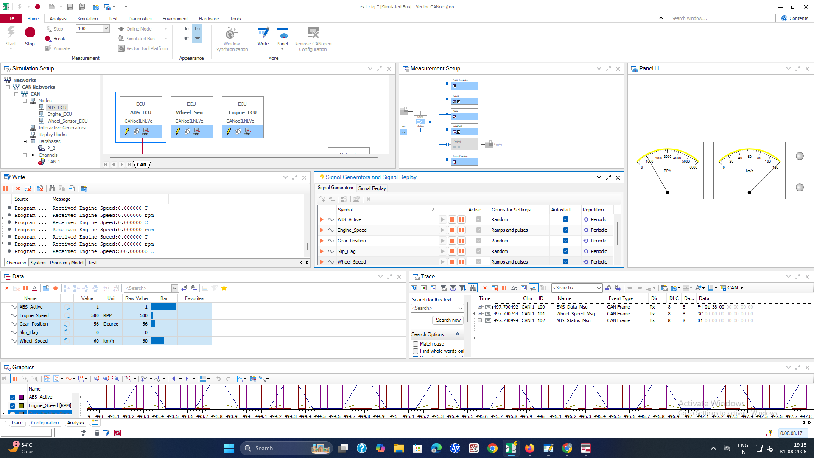
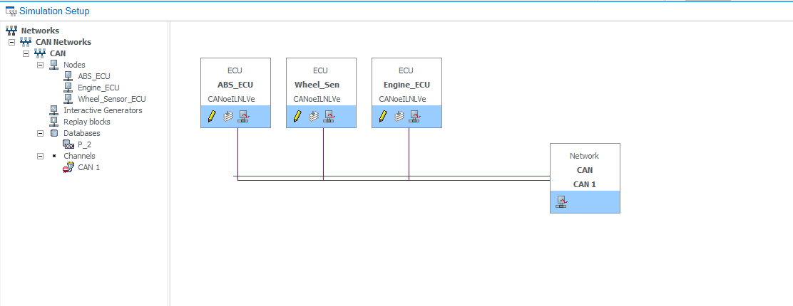
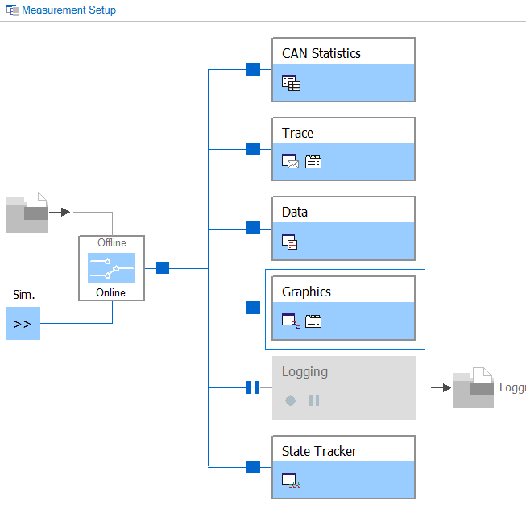
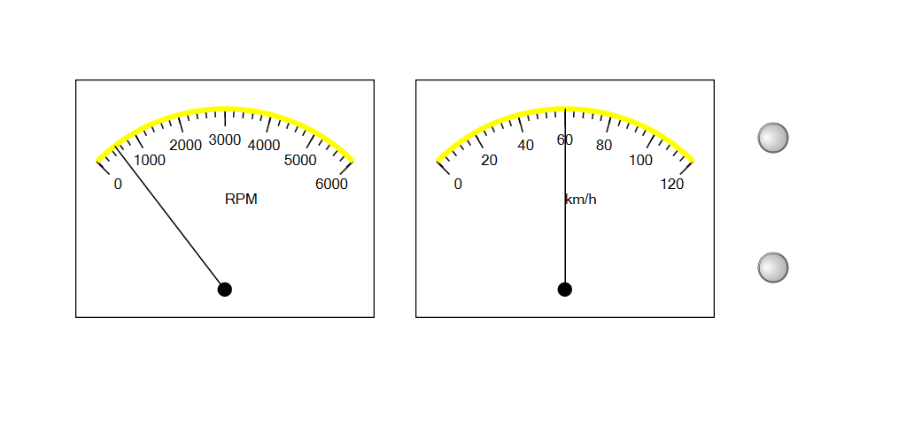
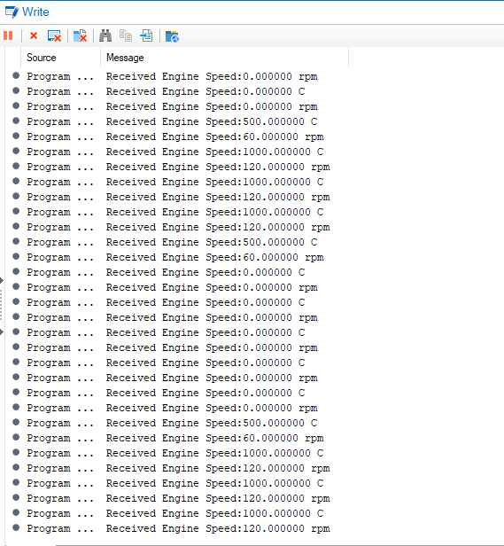
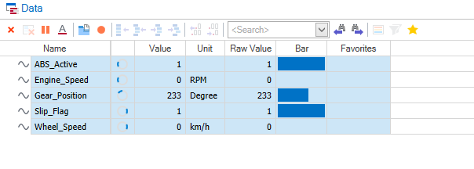
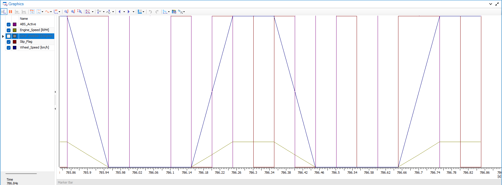

<div align="center">

# 🚗 Vehicle ABS Wheel-Slip Detection

### Simulated CAN network + CAPL logic in Vector CANoe


</div>

---

## 📖 Overview

This project simulates a small automotive CAN network — **Engine ECU**,
**Wheel Speed Sensor ECU**, and **ABS ECU** — inside Vector CANoe, and
implements the ABS/wheel-slip decision logic in **CAPL**.

Every 100 ms, the ABS node compares engine speed against wheel speed. If the
engine is spinning significantly faster than the wheels (i.e. the drive
wheel is slipping), the node raises `ABS_Active` and `Slip_Flag` and
broadcasts the result back onto the bus.

<p align="center">
  
</p>

---

## ⚙️ How It Works

```
 ┌──────────────┐      EMS_Data_Msg       ┌─────────────┐
 │  Engine_ECU  │ ───────────────────────▶ │             │
 └──────────────┘      (Engine_Speed)      │   ABS_ECU   │
                                            │ (CAPL logic)│──▶ ABS_Status_Msg
 ┌───────────────────┐  Wheel_Speed_Msg    │             │    (ABS_Active,
 │ Wheel_Sensor_ECU   │ ──────────────────▶ │             │     Slip_Flag)
 └───────────────────┘   (Wheel_Speed)     └─────────────┘
```

**Decision rule** (runs on a 100 ms timer):

```c
if (Engine_Speed > 1.5 * Wheel_Speed)
    ABS_Active = 1;   Slip_Flag = 1;   // slip detected
else
    ABS_Active = 0;   Slip_Flag = 0;   // normal traction
```

---

## 🗂️ Repository Structure

```
Vehicle-ABS-WheelSlip-Detection-CANoe-CAPL/
├── src/
│   └── ABS_SlipDetection.can   # CAPL node logic (ABS_ECU)
├── dbc/
│   └── P_2.dbc                 # CAN database (signals & messages)
├── docs/                       # Workspace screenshots
├── README.md
└── .gitignore
```

---

## 📡 Signals

| Message           | Signal          | Unit    | Description                     |
|--------------------|-----------------|---------|----------------------------------|
| `EMS_Data_Msg`      | `Engine_Speed`  | RPM     | Engine rotational speed          |
| `Wheel_Speed_Msg`   | `Wheel_Speed`   | km/h    | Wheel speed from sensor          |
| `ABS_Status_Msg`    | `ABS_Active`    | –       | 1 = ABS intervention active      |
| `ABS_Status_Msg`    | `Slip_Flag`     | –       | 1 = wheel slip detected          |
| `ABS_Status_Msg`    | `Gear_Position` | Degree  | Current gear position indicator  |

---

## 🖼️ Screenshots

| File | Description |
|---|---|
|  | Full CANoe workspace — simulation setup, write, data, trace & graphics windows |
|  | CAN trace: `EMS_Data_Msg`, `Wheel_Speed_Msg`, `ABS_Status_Msg` frames |
| | Node/network setup — ABS_ECU, Engine_ECU, Wheel_Sensor_ECU on CAN 1 |
| | Measurement setup block diagram |
| | RPM and km/h gauge panel |
| | Write window log of received Engine Speed values |
| | Live signal values (ABS_Active, Engine_Speed, Gear_Position, Slip_Flag, Wheel_Speed) |
| | Graphics window plotting signals over time |

---

## ▶️ Usage

1. Open the `.cfg` in **Vector CANoe**.
2. Load `dbc/P_2.dbc` as the CAN database.
3. Attach `src/ABS_SlipDetection.can` to the `ABS_ECU` node.
4. Start the simulated bus and watch `ABS_Active` / `Slip_Flag` update live
   in the Data, Graphics, and Trace windows.

---

<div align="center">
Built and simulated with Vector CANoe · CAPL
</div>
